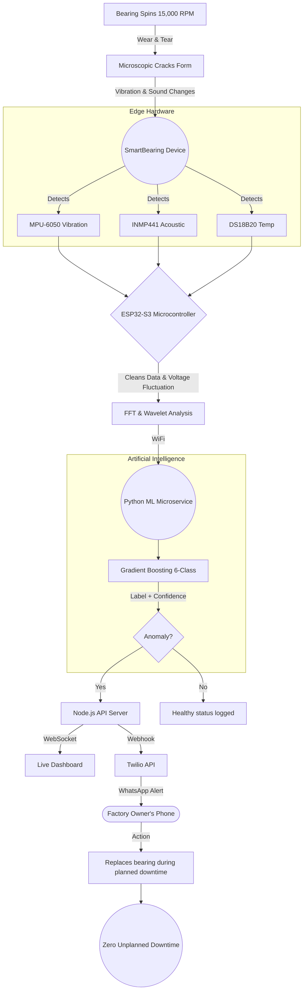
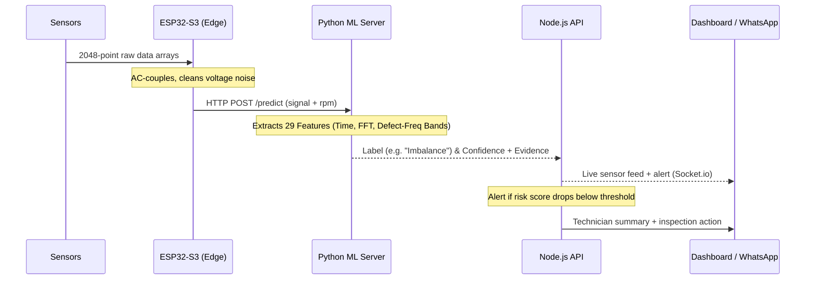

<div align="center">
  <h1>⚙️ SmartBearing</h1>
  <p><b>Rotating Machinery Condition Monitoring — Vibration FFT + Risk</b></p>
  <p>Hackathon Submission · Problem Statement 08</p>
</div>

SmartBearing is an end-to-end condition monitoring system for rotating machinery. It ingests vibration (`accel_x/y/z`), temperature, and RPM data, extracts interpretable features (FFT peaks, RMS, kurtosis), classifies the likely fault type with confidence, and surfaces a risk assessment with recommended inspection actions — before a bearing failure shuts a machine down.

The full stack runs locally in minutes: a **React dashboard** (live charts + WebSockets), a **Node.js API** (Express + Socket.io + MongoDB), and a **Python ML server** (FastAPI + scikit-learn Gradient Boosting) — plus optional Azure OpenAI technician summaries.

---

## 📋 Problem Statement (PS 08)

> **Rotating Machinery Condition Monitoring (Vibration FFT + Risk)** — Bearings and gearboxes fail with early vibration signatures that humans may miss. A system is needed to ingest vibration/temperature/RPM data, detect abnormal frequency peaks (bearing defect frequencies), and provide an interpretable risk assessment with recommended inspection actions.

### Data Considerations (Guidelines)

| Guideline | How SmartBearing meets it |
|---|---|
| Vibration time series: `accel_x/y/z`, `timestamp`, `rpm`, `temp` | ✅ Every reading carries all four; 2048-point raw signal per reading |
| Labels: healthy vs bearing fault vs imbalance vs misalignment | ✅ 6-class model: **Healthy / Imbalance / Misalignment / Ball / Inner Race / Outer Race** |
| Synthetic waveforms acceptable | ✅ `SensorSimulator.ts` + `train_model.py` synthesize spectral signatures for every class (1×/2× RPM, BPFO/BPFI/BSF harmonics) |

### Solution Expectations — Compliance Matrix

| Expectation | Implementation |
|---|---|
| **Ingest** vibration/temperature/RPM data | ✅ `POST /api/sensors/reading` accepts 2048-point signals + temp + RPM; the simulator streams a reading for every spindle every ~3.5 s over Socket.io |
| **Extract features** (FFT peaks, RMS, kurtosis) | ✅ 29-feature pipeline: time-domain (RMS, kurtosis, skewness, crest factor), frequency-domain (FFT stats, spectral entropy, centroid), plus **defect-frequency band-energy ratios** (1×/2× RPM, BPFO/BPFI/BSF/FTF + harmonics) |
| **Classify/score** likely fault type + severity | ✅ scikit-learn Gradient Boosting 6-class prediction with `predict_proba` confidence + full probability vector; health score 0–100 → `healthy / warning / critical` |
| **Detect abnormal frequency peaks (bearing defect frequencies)** | ✅ BPFO/BPFI/BSF/FTF computed from bearing geometry × live RPM — overlaid on the spectrum with harmonics, with an in-app calculator showing the math |
| **Plots**: spectrum + trend | ✅ Live FFT spectrum with defect-frequency ReferenceLines + harmonics; 24 h vibration/temperature trend charts |
| **Short technician summary** | ✅ Azure OpenAI (or OpenAI) generates a 2-sentence summary with recommended action; realistic mock fallback when no key is set |
| **Risk alerts list with evidence** | ✅ Every alert carries an **evidence pack**: triggering spectrum peaks, RMS/kurtosis/crest-factor, confidence, RPM and defect frequencies — expandable in the Alert Center |
| **No direct control actions** | ✅ Monitoring-only — the system never issues shutdown or control commands |
| **Confidence; faults are probabilistic** | ✅ Every prediction returns a confidence percentage |
| **Safety disclaimer (engineer confirmation)** | ✅ Global banner across the entire app |

### Guardrails

- ⚠️ Fault predictions are **probabilistic** — all risk alerts require human engineer confirmation.
- The system **monitors only** and does not issue direct machinery shutdown commands.

---

## 🧩 Architecture



### Data Flow



---

## 🧠 The ML Pipeline

The Python ML server (`artifacts/api-server/src/ml/server.py`) hosts a trained scikit-learn Gradient Boosting model. Training data is synthesized in `train_model.py` with the exact spectral signatures of each fault class. For every 2048-point signal it:

1. **Extracts 29 features** (shared `features.py` — used identically by training & inference):
   - **Time domain:** RMS, mean, std, kurtosis, skewness, crest factor, shape factor, impulse factor.
   - **Frequency domain:** FFT mean/std/max/energy, dominant frequency + amplitude, spectral entropy, spectral centroid.
   - **Defect-frequency bands:** spectral-energy ratios at 1×/2× RPM, BPFO, BPFI, BSF, FTF + harmonics — computed from bearing geometry × live RPM.
2. **Predicts fault class** with confidence + full probability vector: `Healthy`, `Imbalance`, `Misalignment`, `Ball`, `Inner Race`, or `Outer Race`.
3. **Returns defect frequencies + evidence** and generates a technician summary — Azure OpenAI preferred, plain OpenAI fallback, realistic mock fallback otherwise.

> **Graceful degradation:** if the ML server is offline, the simulator runs a deterministic DSP fallback that computes the same band-energy ratios from the real FFT — the dashboard and alerts keep working with genuinely computed verdicts, never fabricated ones.

### Retraining

```bash
cd artifacts/api-server/src/ml
python train_model.py   # synthesizes 6 classes, trains, saves smartline_final.pkl + label_encoder.pkl
```

### Bearing Defect Frequencies

The system computes the classic rolling-element defect frequencies from geometry + live RPM (`lib/defectFrequencies.ts` frontend / `features.py` backend) and overlays them with harmonics on every spectrum:

- **BPFO** — Ball Pass Frequency, Outer race: `(N/2)·fᵣ·(1 − d/D·cos α)`
- **BPFI** — Ball Pass Frequency, Inner race: `(N/2)·fᵣ·(1 + d/D·cos α)`
- **BSF** — Ball Spin Frequency: `(D/2d)·fᵣ·(1 − (d/D·cos α)²)`
- **FTF** — Fundamental Train Frequency: `(fᵣ/2)·(1 − d/D·cos α)`

where `fᵣ = RPM/60`, N = ball count, D = pitch diameter, d = ball diameter, α = contact angle. Harmonics (×2, ×3) confirm a fault rather than a single spurious peak.

---

## 🔩 Hardware Stack

| Component | Purpose | Why it matters |
|-----------|---------|----------------|
| **ESP32-S3** | Edge brain | High-speed sampling + WiFi on a low-cost MCU |
| **MPU-6050** | Vibration sensor | Captures the physical shaking caused by bearing friction |
| **INMP441** | I2S microphone | High-frequency acoustics beyond human hearing |
| **DS18B20** | Temperature sensor | Detects thermal anomalies as friction increases |
| **ZMPT101B** | Voltage sensor | Compensates for factory voltage fluctuations to prevent false positives |

Reference firmware: [`artifacts/edge-firmware/smartbearing-edge-node/`](artifacts/edge-firmware/smartbearing-edge-node/README.md)

---

## 🎨 Dashboard Features

- **Live Sensor Feed** — real-time vibration (x/y/z), temperature, and RPM streamed over WebSockets.
- **Machine Learning Integration** — watch the model predict fault type + confidence on live synthesized signals.
- **FFT Visualization** — frequency spectrum with BPFO/BPFI spike annotations and severity reference lines.
- **Risk Assessment** — interpretable 0–100 risk score per machine, with status bands (healthy / warning / critical).
- **Alerts with Evidence** — severity, anomaly score, estimated time-to-failure, and technician summary.
- **Fleet Overview & Trends** — fleet risk, 24 h vibration trends, downtime-prevented and ₹-saved metrics.
- **PDF & CSV Export** — one-click fleet reports for management.
- **ROI Calculator** — estimated savings per factory.

---

## 🚀 Running the Project Locally

### Prerequisites

- **Node.js** (v18+) & **pnpm** (v9+)
- **Python** (v3.9+)
- **MongoDB** running locally on `localhost:27017` (or set `MONGODB_URI`)

### 1. Install dependencies & seed the database

```bash
pnpm install
pnpm --filter @workspace/api-server run seed
```

The seed script creates demo users, machines (M001–M006), spindle readings, alerts, and maintenance logs.

### 2. Start the ML server (optional but recommended)

```bash
# Windows
.\start-ml.bat
# or manually:
cd artifacts/api-server/src/ml
pip install -r requirements.txt
uvicorn server:app --host 127.0.0.1 --port 8000
```

> The API works without it (RMS heuristic fallback), but the ML server enables real XGBoost predictions.

### 3. Start the Backend API & Simulator

```bash
SIMULATOR_AUTO_START=true pnpm --filter @workspace/api-server run dev
```

Starts the API on **port 5000** and the sensor simulator (streams synthetic bearing signals every ~3.5 s).

### 4. Start the Dashboard

```bash
pnpm --filter @workspace/smartbearing run dev
```

Open **http://localhost:5173** in your browser.

### Demo Credentials

| Role | Email | Password |
|------|-------|----------|
| Admin | `admin@smartbearing.com` | `Admin@123` |
| Operator | `operator@smartbearing.com` | `Operator@123` |

You can also register a new factory account from the login page.

### Azure OpenAI Technician Summaries (optional)

Copy `artifacts/api-server/src/ml/.env.example` → `.env` and set:

```env
AZURE_OPENAI_API_KEY=...
AZURE_OPENAI_ENDPOINT=https://your-resource.openai.azure.com/
AZURE_OPENAI_DEPLOYMENT=gpt-35-turbo
```

Plain OpenAI (`OPENAI_API_KEY` / `OPENAI_MODEL`) also works. Without any key, summaries fall back to a realistic mock.

---

## ☁️ Deployment

| Piece | Platform | What deploys |
|---|---|---|
| Frontend (React/Vite) | **Vercel** | `artifacts/smartbearing` |
| API server (Express + Socket.io + MongoDB) | **Render** | `artifacts/api-server` (via `render.yaml`) |
| ML predictor (FastAPI + scikit-learn) | **Render** | `artifacts/api-server/src/ml` (via `render.yaml`) |

See **[DEPLOYMENT.md](DEPLOYMENT.md)** for the full setup (MongoDB Atlas + Render blueprint + Vercel).

---

## 🗂️ Project Structure

```
artifacts/
  api-server/            # Node.js API (Express + Socket.io + MongoDB)
    src/ml/              # Python FastAPI ML server (scikit-learn, 29 features, 6 classes)
  smartbearing/          # React + Vite dashboard
  edge-firmware/         # ESP32-S3 reference firmware (Arduino)
lib/                     # Shared TS packages (db, api-zod, api-client-react)
scripts/                 # Workspace tooling
```

---

## 👥 The Team

| Name | Role | Responsibilities |
|------|------|------------------|
| **Prateek** | AI & ML Architecture | ML model training, feature extraction, CAD enclosure design |
| **Varun Sreeram** | Backend API | Node.js server, WebSocket streaming, WhatsApp integration |
| **Vaishnav** | Frontend & UI/UX | React dashboard, 3D visualizations, Recharts data plotting |
| **Sri Charan** | Operations & DevOps | Repository management, code integrations |

---

<div align="center">
  <i>Built to bring enterprise-grade AI to the local factory floor.</i>
</div>
